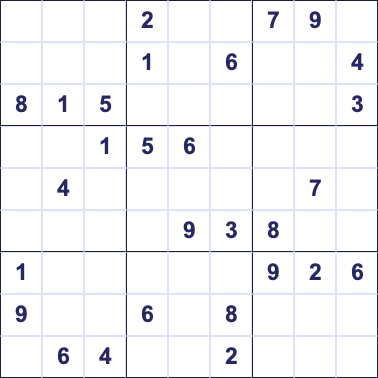
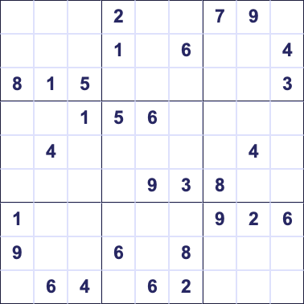

# Crack code interview problems in Python 🐍

This repo contains the problems solved during the Crack code interview problems in Python series from the Microsoft Reactor.

You can find details for the upcoming episodes, and register on the [Microsoft Reactor site](https://developer.microsoft.com/reactor/series/S-1111/).

## Episodes

### Episode 1 - sudoku validator

Determine if a 9x9 initial sudoku board is valid - that is the numbers on the initial state of the board reflect a valid sudoku puzzle. This puzzle doesn't need to be solve or be solvable, it just needs to be valid.

A complete sudoku puzzle is a 9x9 grid, made of 9 3x3 grids. Each 3x3 grid must contain the all numbers 1-9, and each horizontal and vertical grid of the 9x9 puzzle also must contain all the numbers 1-9.

An initial sudoku board has some of the numbers filled in, and the aim of the puzzle is to calculate what the rest of the numbers would be.

#### Example 1 - a valid sudoku board

#### Example 2 - an invalid sudoku board

In this board - the center horizontal line has duplicated 4s. The bottom horizontal line has duplicated 6s, and the center bottom 3x3 grid also has duplicated 6s.

